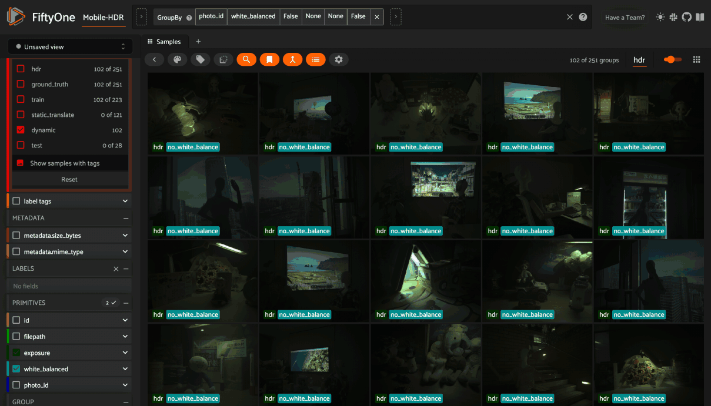

# Joint HDR Denoising and Fusion: A Real-World Mobile HDR Image Dataset in Fiftyone




This repository contains Python code that ingests the [Joint HDR Denoising and Fusion: A Real-World Mobile HDR Image Dataset](https://github.com/shuaizhengliu/Joint-HDRDN) into Fiftyone.

## Steps

### Transforming data into sRGB

Make sure you have all the npz files in your local directory.
```
├── Mobile-HDR
    ├── NPZ_data
         ├── training_npz
              ├── static_translate
              ├── dynamic
         ├── test_npz
              ├── test_withGT
              ├── test_withoutGT
```


Assuming `python >= 3.10` is available in your environment, run the following:
```
python -m venv venv
source venv/bin/activate

pip install -r requirements.txt

python transform_data.py
```

### Importing into Fiftyone

```
source venv/bin/activate 

python import_fiftyone.py --help
```